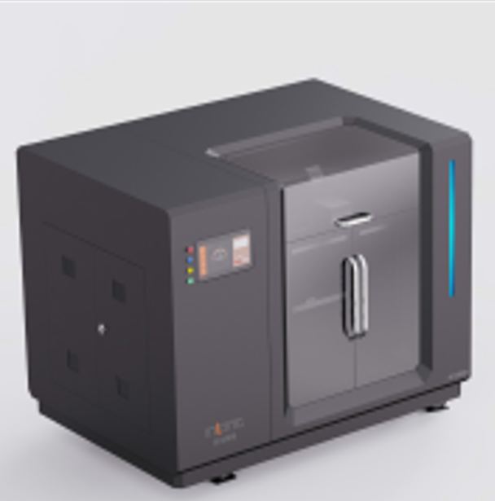

# OrcaSlicer G-code 后处理脚本



## 项目介绍

这是一个用于 OrcaSlicer 的 G-code 后处理脚本，用于SC12060的接续打印。

### 主要功能

1. **COM8端口错误续接**：出现com8端口错误时，记录打印高度并在OrcaSlicer中使用脚本生成后续gcode;
2. **断料检测失效出现空打时续接**：量出已打印高度，使用脚本；
3. **出现停电等意外情况时续接**：量出已打印高度，使用脚本；

## 使用方法

### 方法一：在 OrcaSlicer 中配置（推荐）

1. 打开 OrcaSlicer
2. 进入 "Others" 选项卡
3. 在 "Post-processing Scripts" 中输入可执行文件的完整路径：
   ```
   d:\Users\shucai\Desktop\sc12060_continue\target\release\sc12060_continue.exe
   ```
4.设置暂停点;
5. 点击导出 G-code，脚本会自动处理

### 方法二：单独运行

在命令行中执行：

```powershell
target\release\sc12060_continue.exe your_file.gcode
```

## 项目结构

```
sc12060_continue/
├── src/
│   └── main.rs              # 主程序源码
├── target/
│   └── release/
│       └── sc12060_continue.exe  # 编译后的可执行文件
├── Cargo.toml               # Rust 项目配置
└── README.md                # 本文件
```

## 编译项目

如果你需要自己编译项目：

```powershell
# 编译发布版本
cargo build --release

# 编译后的文件位于 target/release/sc12060_continue.exe
```

## 要求

- Windows 、Mac、Linux 操作系统均可
- OrcaSlicer 2.x（如果用于后处理）
* Rust编译工具链（官网下载安装即可）

## 工作原理

1. 读取 G-code 文件
2. 定位关键标记：
   - `EXECUTABLE_BLOCK_START`：执行块开始
   - `LAYER_CHANGE`：层切换标记
   - `PAUSE`：暂停指令
3. 执行处理逻辑
4. 输出处理后的文件

## 许可证

本项目使用 MIT 许可证。
